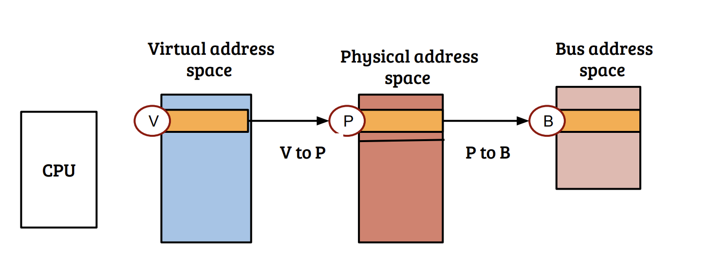

I've been struggling to find good materials online about the basics of I/O virtualization.
But I came across the book, "Hardware and Software Support for Virtualization", and its covered everything I was ever confused about I/O virtualization.
And, as any learner should, I'm explaining what I've learned by reading this material so that I can truly absorb it as my own. 

---

# Physical I/O
Before understanding virtual I/O, it's imperative to understand how physical I/O works for a non-virtualized OS.

## Discovering I/O Devices
Upon booting, the OS must figure out which devices are connected to the motherboard. The UEFI (firmware on the mainboard) provides a description of the available devices to the OS. It does so in some standard format, such as the Advanced Configuration and Power Interface (ACPI) format. 

## Interacting with I/O Devices
There are three ways I/O devices interact with the CPU and memory:
### Port-mapped I/O(PIO) and memory-mapped I/O (MMIO)
PIO and MMIO are usually used to read and write to registers of a I/O device. By doing so, the OS can write commands to the I/O devices and to read the statuses of the execution of the commands.

Upon booting, the UEFI associate the registers of the I/O devices with unique addresses. 

For PIO, these addresses are "ports", which are special addressess that the OS uses with OUT and IN x86 instructions to write/read from device registers. These addresses are special in that they can be accessed directly without using page table mapping. 

For MMIO, these addresses are physical memory addresses, and just like normal memory operations, the OS uses regular x86 load and store operations through the memory bus. 

A process can only see its virtual addresses. Therefore, for a guest to MMIO to a device, it loads from or stores to a virtual address. Then, the MMU determines whether the address is MMIO by looking at the page table entry for that virtual address and checking its flags. Just like any other virtual address, this page table is also cached in the TLB, so the next time the virtual address is referenced, the MMU is not involved. 

Afterwards, the MMIO controller inside the chipset translates the physical address into the corresponding IO address. 

### Direct Memory Access (DMA)
Since PIO and MMIO both involve the CPU issuing commands, they are both inefficient in moving large amounts of data to/from I/O devices. A better alternative is for devices to directly access memory without CPU involvement using DMA. With DMA, the CPU becomes only involved in initiating the DMA operation, and the post-processing after the I/O device completes DMA and asynchronously notifies of completion.

### Interrupts
I/O devices notifies such asynchronous events by issuing interrupts to the CPU core. Each interrupt is associated with a number (also called the "interrupt vector"), which corresponds to an entry in the x86 Interrupt Descriptor Table (IDT). Each entry in the table points to an appropriate interrupt-handler OS routine. 

### LAPIC
The Local Advanced Programmable Interrupt Controller (LAPIC) is a per-core controller responsible for processing interrupt-related operations including enabling/disabling interrupts, notifying the hardware upon interrupt handling completion, etc. The LAPIC includes an interrupt request register (IRR) which marks interrupt requests that have not been yet handled, the in-service register (ISR) which marks interrupts that are currently being handled, and the (EOI) register which marks the completion of the handling of an interrupt.

In summary, the only type of OS/device interaction are the three listed above - 

**OS to device:** 1. MMIO/PIO; 

**device to OS:** 2. reading to and writing from memory via DMA, 3. raising interrupts. 

## I/O Virtualization
For virtual machines to share I/O devices, the hypervisor must itervene. The hypervisor needs to provide the illusion that the guests are directly accessing the real devices, while acting as an intermediary such that it acts on behalf of the guests to actually access the real device. The hypervisor does this by trapping all the guest's I/O-related operations and emulating them.

### I/O emulation (Full Virtualization)
For each emulated device, the VM must have the appropriate driver for the hypervisor to match with its own network emulation layer, such that these two software components are compatible.

**DMA emulation:** hypervisor reads and writes to guest memory as if a device is reading and writing.

**MMIO emulation:** 
hypervisor sets memory such that when the guest reads/writes to memory locations set for MMIO, the guest traps to the hypervisor. It can do so by mapping the pages as reserved/non-present, or as read-only. For example, the KVM/QEMU hypervisor encapsulates a VM within a QEMU process. The process runs a different thread for each vCPU and virtual device of the VM. Each vCPU thread has two execution contexts: one for the guest VM and one for the host QEMU. The latter is responsible for handling exits of the guest vCPU context. 

Suppose the guest VM device driver issues MMIO to the device by attempting to read/write on read/write-protected memory. This triggers an exit that suspends the VM CPU context and invokes the KVM. The KVM relays the events back to the very same vCPU thread, to its host execution context, providing it with the register's address and a description of the attempted operation. QEMU's device emulation layer then processes these events through system calls to access the actual physical devices. The emulation layer emulates DMAs by writing/reading to/from the guest's I/O buffers, which are accessible via shared memory. It then resumes the guest execution context via KVM, possibly injecting an interrupt to signal to the guest that I/O events occured.

**PIO emulation:** Guest PIOs are privileged instructions, and they hypervisor can configure the guest's VMCS to trap upon them. 

**Interrupt injection:** The hypervisor can use the VMCS to inject interrupts to the guest. 

### I/O para-virtualization
I/O emulation introduces substantial performance overheads for mainly two reasons: 
1. The physical device was not designed to be emulation-efficient. For example, sending and receiving a single Ethernet frame may involve multiple register accesses, which translate to multiple exits per frame. 
2. Unneccessary exits that could have been optimized but cannot unless the code is "virtualization aware". 

In paravirtualzation, the virtual device is defined with virtualization in mid, so as to minimize the number of exits.

The guest must install a special device driver that is only compatible with its hypervisor. So, guests and hosts agree upon a virtual device specification to be used for I/O emulation - this specification does not apply to any real physical device.

The upside is better performance. The downside is that paravirtualization is less portable than emulation, as drivers that work for one hypervisor will typically not work for another. Additionally, hypervisor developers who wish to make paravirtualization available for their guest OSes will need to implement and maintain a different paravirtual device driver for every type of guest OS they choose to support.

### Front-ends and Back-ends
All production hypervisors architect their virtual I/O stacks to consist of a front-end and a back-end. The front-end includes a guest virtual device driver and a matching hypervisor emulation layer. It is the interface that is exposed to the virtual machine. The back-end is used by the front-end to implement the functionality of the virtual device using the physical resources of the host system. The two components are designed to be independent of each other.

## Hardware support for I/O Virtualization
Instead of interposing on I/O and emulating functionality, it is much more performant to directly assign a device to a VM, without any hypervisor involvement. Although it is much more performant, there is the problem of lack of scalability - physical I/O devices are limited in quantity compared to the number of VMs a modern machine can support. The second problem is that if a VM directly controls a device, it could use the device to perform DMA operations to any physical memory location, even to one not allowed to be read/written by the VM. This is because the hypervisor doesn't interpose between the device and check its read/write permissions to a specific memory address.

Therefore, to enable direct device assignment, hardware support for I/O Virtualization include two main components: 
1. I/O Memory Management Unit (IOMMU) for security
2. Single-Root I/O Virtualization (SRIOV) for scalability

### IOMMU
IOMMU was introduced in Intel's Virtualization Technology for Directed I/O (VT-d), and AMD's I/O Virtualization Technology (AMD-Vi).
The IOMMU is located in the PCIe root complex (RC) consists of two main components: 
1. a DMA remapping engine (DMAR) 
2. an interrupt remapping engine (IR)

DMAR allows DMAs to be carried out with I/O virtual addresses (IOVAs), which the IOMMU translates into physical addresses according to page tables that are set by the hypervisor. 

More specifically, when a DMA propagates upstream through the PCIe hierarchy, it reaches the root complex, and the IOMMU uses the 16-bit bus-device-function (BDF) number to retrieve the root of the page table hierarchy that is used to page-walk and translate the IOVA in question into its matching PA.
PCIe defines interrupts (MSI/MIS-X) similarly to DMA memory writes directed at some dedicated address range, which the RC identifies as the "interrupts space". In x86, this range is 0xFEEx_xxxx (where x can be any hex digit). Each interrupts message is self-describing: it encodes all the information required for the RC to handle it.

IR translates interrupt vectors fired by devices based on an interrupt translation table configured by the hypervisor. This is needed for security. Crucially, without IR, the IOMMU cannot distinguish between a legitimate, genuine MSI interrupt fired by a device, and a rogue DMA that was programmed to the device by the malicious VM, pretending to be an interrupt and writing some malicious value in the interrupts space.

With IR, the type and format of the MSI registers in the configuration space change from storing the physical interrupt vector and target LAPIC, MSI registers, to store an IRindex, which is an index to the IR table, poinrted to by the IR Table Address (IRTA) register at the IOMMU. As before, the content of MSR registers in the physical configuration space is exclusively set by the hypervisor. So, when a device fires an interrupt, the IOMMU translates the "address" and data" to its appropriate target LAPIC and physical interrupt vector based on the associated IR table entry. 

### SRIOV
an SRIOV-capable I/O device can present multiple instances of itself to software. Each instance can then be assigned to a different VM, to be used directly, without any software intermediary. In other words, the role of multiplexing the device transfers from the OS to the device hardware.
An SRIOV device is defined to have atleast one Physical Function (PF) and multiple Virtual Functions (VF).

A PF is a standard PCIe function. 

A VF is a lightweight PCIe function that implements only a subset of the components of a standard PCIe function. When a VF is assigned to a VM, the VF provides the VM the ability to do direct I/O - the VM can safely initiate DMAs, such that the hypervisor remains uninvolved in the I/O path. 

### Exitless Interrupts
Direct device assignment elimiates most of the exits that occur when VMs "talk" to their assigned devices, but does not address the exits generated when assigned devices "talk back" by triggering interrupts. Intel VT-x provides hypervisor with the basic hardware support needed to inject virtual interrupts into the guests.

Similar to other CPU registers, the VMCS stores the value of the guest's Interrupt Descriptor Table Register (IDTR) such that it is loaded upon entering guest mode and saved on exit, when the hypervisor's IDTR is loaded instead.