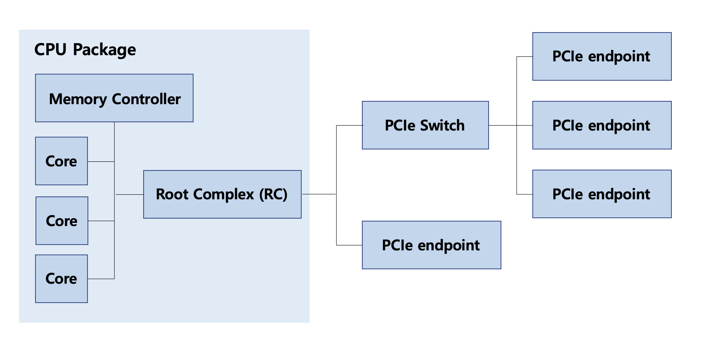

PCIe (Peripheral Component Interconnect Express) is an interface standard used to connect the CPU package and various external devices on a motherboard. It is used commonly to connect devices such as GPU and NVMe SSD, to the CPU. From what I've read, it seems like you can think of PCIe as a sort of network protocol - except the network only spans your motherboard. 

Like a lossless network infrastructure, PCIe consists of three layers (transcation, data link, physical), and transmits packets over links from one node to another according to well-defined routing rules. It has flow control, error detection, retransmission, and quality of service.

A PCIe link is a physical, point-to-point connection between two PCIe ports. A link consists of one or more lanes, and each lane has two differential signal pairs: one used to send data and one used to receive data. These links are the actual copper traces on the motherboard that carry PCIe signals between components.

Any piece of hardware that can send and receive PCIe traffic over these links is considered a PCIe device. This includes endpoint devices such as GPUs, network cards, and NVMe SSDs, PCIe switches on the motherboard that route PCIe traffic, and the Root Complex, which is the hardware inside the CPU package that connects CPU cores to the PCIe network.

Together, all PCIe devices and the links that connect them form the PCIe fabric, by which we mean the entire interconnected PCIe network in the system.

A PCIe fabric follows the structure below:

<figure>
    
</figure>

When the system boots, the firmware or operating system scans the PCIe fabric to discover which PCIe devices and functions are present and how they are connected. 
As a result of this enumeration process, the operating system is able to build a logical configuration hierarchy that it uses henceforth to address and configure the connected PCIe hardware.

A PCIe device implements one or more PCIe functions, which is the smallest unit configurable by the system. It is a concrete hardware logic block inside a PCIe device that implements its own configuration space and responds to configuration requests. Functions are either bridges or endpoints. Endpoints correspond to individual I/O channels in physical PCIe devices (for example, a dual-port NIC has two endpoints).

To communicate with individual PCIe functions, the OS assigns three identifiers: a bus number, a device number, and a function number. Together, these form a bus:device.function (BDF) address, which uniquely identifies a PCIe function in the system. These identifiers are used to route PCIe configuration transactions through the fabric.

A "bus" represents a group of PCIe functions that all use the same immediate connection toward the CPU.

A PCIe "bridge" connects two buses: one bus closer to the CPU and one bus farther from the CPU. It is the component that separates one group of PCIe functions from another, and forwards PCIe transactions either toward the CPU or toward devices, depending on where the destination lies.

Because bridges separate the PCIe hierarchy into distinct groups, bus numbers are assigned at bridge boundaries so software can describe which side of a bridge a function is located on.

A PCIe "switch" is a physical device that contains multiple PCIe bridges. It has one connection facing the CPU and multiple connections facing devices, allowing PCIe traffic to be routed between them.

Overall, the PCIe fabric is organized so that physical links carry data between components, while bus and function numbers give software a simple, consistent way to locate and configure PCIe devices.

## PCIe devices
There are two types of devices in PCIe: Type 0 which are the actual devices, and Type 1, which are switches.
Each PCIe device is identified by its corresponding BDF, which is a 16-bit number consisting of 8,5,3 bits.

## PCIe requests
PCIe defines four main request types: Memory Transaction, I/O Request, Configuration Space Access, and Message. The first three rely on memory access. 
The implementation of memory access-based requests in PCIe uses the following mechanism:
- Each device in PCIe, whether it is an Endpoint (Type 0) or a Switch (Type 1), will be allocated its own memory address space, and this address space will be mapped to the system's physical address space and ultimately mapped to virtual memory.
- When the CPU initiates a memory read or write request, if the address is translated by the MMU and the final physcial address falls into the memory space of a PCIe device (the physical address space not only includes physical memory, but also the memory of PCIe devices), it will trigger the Root Complex to convert it into a PCIe request and send it to the corresponding device through the PCIe bus.

## Device Configuration Space
The OS discovers PCIe devices using the standard "MCFG" ACPI table. 
In PCIe, each device has an independent, 4KB sized configuration space array. This array is located in the device and provides device information via a standard format. The OS accesses the array via MMIO operations. 
The first 256 bytes constitute a valie PCI configuration space, and the rest are extended config registers. Out of the first 256 bytes, the first 64 bytes make up the PCIe header, which identifies attributes like the functional class of the device (network, storage, etc.), the vendor ID (assigned by PCI-SIG), and the device ID (assigned by the vendor). These attributes allow the OS to identify the devices, associate them with appropriate drivers, initialize them, and make them available for general use.
Each PCIe device can have up to six Base Address Registers (BARs).

### Base Address Register
“The BAR publicizes the MMIO (or PIO) addresses to be used when the OS wishes to interact with the device.”

This sentence was very vague and not intuitive to me when I first came across it.
After much searching and doubting what chatGPT told me… I came across a [blog post](https://ctf.re/kernel/pcie/tutorial/dma/mmio/tlp/2024/03/26/pcie-part-2/) which explains DMA and MMIO so well, I was so touched while reading it.

Anyways, this is what I gathered:

The host (CPU) performs MMIO when it wants to read/write something on the device, whether it be device memory or device registers. MMIO, as you probably know, is a way of the host OS using LOAD/STORE instructions (like LOAD 0x00008000), and actually reading/writing data from/to an I/O device, just like it would if it were addressing DRAM. But if the physical address falls under a certain range, the memory subsystem does not access DRAM; instead, the access is forwarded to the PCIe root complex, routed through the PCIe fabric, and delivered to the target device.

But how does the host OS know which certain range to write to? For example, suppose the host OS wanted to tell the GPU to start DMA so that it writes 0x20 bytes from the host’s memory address 0x001FF000 to the device’s address 0x00008000 (borrowing the example from the blog post above).
Where on the GPU should the host OS write to, so that the GPU understands what the host OS wants?

Well, device manufacturers define this interface through MMIO register layouts, which are exposed to the host via BARs.
For example, suppose the GPU manufacturer specifies in its documentation that:

- any 64-bit value written to BAR0 + 0x00 is interpreted as the destination address for DM
- any 64-bit value written to BAR0 + 0x08 is interpreted as the source address for DMA
- any 64-bit value written to BAR0 + 0x10 is the DMA transfer size
- any 64-bit value written to BAR0 + 0x18 controls whether to initiate DMA

The host OS understands this contract and issues instructions to write 0x00008000 to BAR0 + 0x00, 0x001FF000 to BAR0 + 0x08, 0x20 to BAR0 + 0x10, and 0x1 to BAR0 + 0x18.
These MMIO writes arrive at the GPU as PCIe Memory Write transactions, update device registers at those offsets, and the GPU’s DMA engine reads those registers and initiates the transfer exactly as instructed.

Now, you might be asking the question: who sets the value of BAR0 itself?
During PCIe enumeration, the firmware or host OS assigns physical address ranges to each BAR and writes those base addresses into the device’s BAR registers, ensuring a functional, non-overlapping physical address layout across all devices managed by the system.

A final missing question is: why do devices use BARs to tell the host OS about their MMIO layouts?
From what I’ve gathered, there are two main reasons:

**1. Limited discovery interface at enumeration time.**

Upon enumeration, the firmware or host OS only has access to each PCIe device’s configuration space, whose MMIO address is standardized and whose size is limited (4 KB). This configuration space is meant only for discovery and basic control, not for exposing the full device interface. A device’s operational MMIO region - where registers, DMA descriptors, doorbells, etc. live - may be much larger than 4 KB. Therefore, instead of describing the entire MMIO layout in configuration space, the device exposes only the base and size of its MMIO regions via BARs, and the detailed meaning of offsets within that region is defined by the device specification.

**2. Decoupling device design from system address layout.**

BARs introduce a layer of abstraction that allows the base address of a device’s MMIO region to be assigned and changed by the firmware or host OS. The device itself does not hardcode physical addresses; it only declares how much address space it needs. This lets the host OS freely construct a non-overlapping, system-wide physical address layout across many devices, independent of device type, boot order, or platform constraints.

